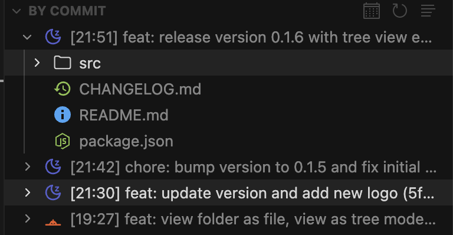
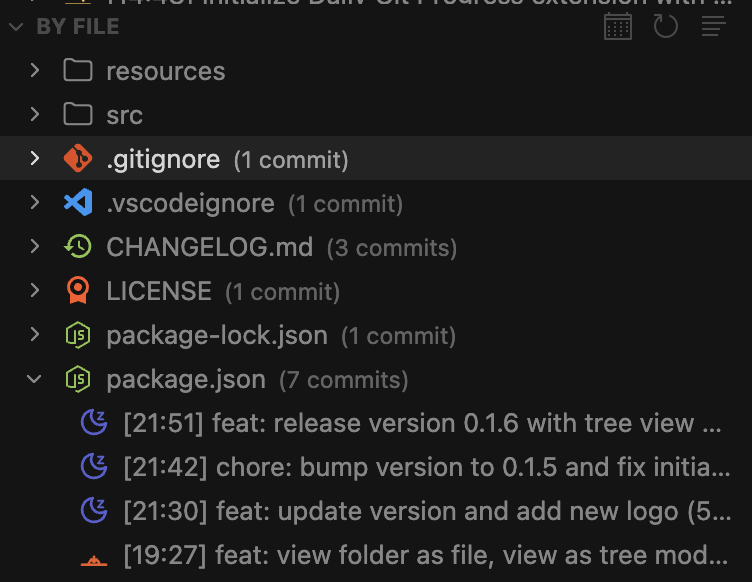
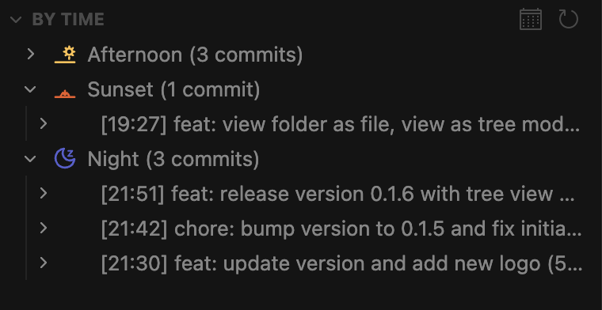

# Daily Git Progress

View your git commits organized by date with both commit-based and file-based views. Review what you did today or check changes from any specific date.

Perfect for daily standup prep, reviewing your work, or tracking progress over time. See exactly what files changed and when throughout the day.

## Features

- **Three Views**: Switch between "By Commit" (chronological), "By File" (grouped by file), and "By Time" (grouped by time ranges)
- **Time Visualization**: Time-of-day icons show when commits were made (sunrise, noon, sunset, moon, etc.)
- **Date Selection**: Quickly jump to Today, Yesterday, or pick any custom date
- **Local Timezone**: All timestamps shown in your local time for easy reading
- **Tree/List Toggle**: View files as flat list or folder hierarchy in both panels
- **Click to View**: Click files to view content at specific commit, click commits to see diff
- **File Icons**: Proper file icons displayed instead of folder icons
- **Separate Panels**: All views visible simultaneously, each collapsible

## Usage

1. Open the "Daily Git Progress" panel from the activity bar
2. Default shows today's commits in three views:
   - **By Commit**: Commits in chronological order with time icons, expand to see files
   - **By File**: Files grouped together, expand to see all commits that touched them
   - **By Time**: Commits grouped by time ranges (morning, afternoon, evening, night)
3. Click the calendar icon in title bar to change date
4. Click any file to view content at that commit
5. Click any commit item to view diff against previous commit
6. Toggle tree/list view using the icon button
7. Click refresh to update

## Location

Located in its own activity bar container. Can be moved to other locations like Source Control or Explorer by dragging.

## Commands

- **Change Date...**: Pick a different date to review
- **Refresh**: Update the current view
- **View as Tree/List**: Toggle between flat list and folder hierarchy (applies to both panels)
- **Open Diff**: View file changes from a specific commit
- **Open File**: Open the file directly

## Timeline

- sunrise - 7am-9am
- morning - 9am-11am
- noon - 11am-1pm
- lunch - 1pm-2pm
- afternoon - 2pm-4pm
- evening - 4pm-6pm
- sunset - 6pm-8pm
- night - 8pm-7am

## Release Notes

See [CHANGELOG.md](CHANGELOG.md) for detailed release history.
